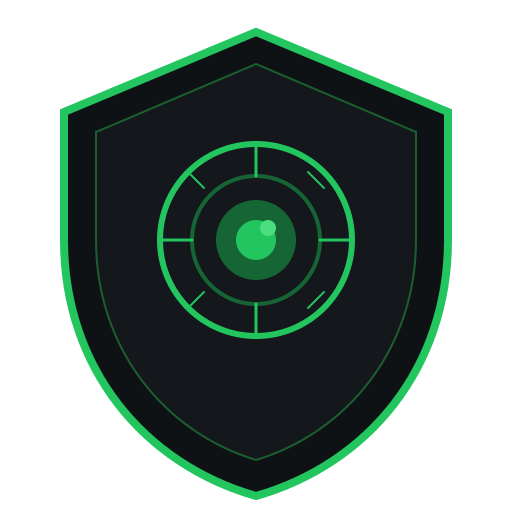

# SafeOS Guardian

<div align="center">
  <picture>
    <source media="(prefers-color-scheme: dark)" srcset="apps/guardian-ui/public/logo.svg">
    <source media="(prefers-color-scheme: light)" srcset="apps/guardian-ui/public/logo.svg">
    
  </picture>

  <h3>Free AI-Powered Monitoring for Pets, Babies, and Elderly Care</h3>
  <p><strong>Part of Frame's Humanitarian Initiative</strong></p>

  <p>
    <a href="https://frame.dev">frame.dev</a> |
    <a href="https://safeos.sh">safeos.sh</a> |
    <a href="mailto:team@frame.dev">team@frame.dev</a>
  </p>

  [](https://opensource.org/licenses/MIT)
  [](https://www.typescriptlang.org/)
  [](https://codecov.io/gh/framersai/safeos)
  [](https://frame.dev)
</div>

---

## CRITICAL DISCLAIMER

**SafeOS Guardian is NOT a replacement for:**
- Parental or caregiver supervision
- Medical monitoring equipment
- Professional elderly care
- Veterinary monitoring systems

This is a **FREE SUPPLEMENTARY TOOL** designed to assist caregivers, not replace them.

**NEVER leave dependents unattended with only this system.**

---

## Features

### Offline-First Deep Learning

All core detection runs **entirely offline** using client-side deep learning:

- **Visual Fingerprinting**: Color histogram analysis, dominant color extraction, and edge detection run directly in the browser using Canvas APIs
- **Motion Detection**: Pixel-diff analysis with configurable sensitivity
- **Audio Analysis**: Cry detection and distress sound recognition
- **Lost & Found Matching**: Real-time visual matching against reference photos

**No internet connection required for core functionality.**

### Optional LLM Enhancement (Ollama)

For enhanced scene understanding, you can optionally enable Ollama integration:

- **Moondream**: Fast triage model (~500ms response)
- **LLaVA 7B**: Detailed analysis when concerns detected
- **Cloud Fallback**: OpenRouter, OpenAI, Anthropic for complex cases

This is **entirely optional** - the app works fully offline without it.

### Lost & Found Detection

SafeOS includes a powerful lost pet/person detection system that runs entirely in your browser:

1. **Upload Reference Photos**: Add 1-5 clear photos from different angles
2. **Visual Fingerprinting**: The system extracts:
   - Color histograms (32 buckets)
   - Dominant colors (top 5)
   - Edge signatures (8x8 grid)
   - Size ratio estimates
3. **Real-Time Matching**: Every camera frame is compared against stored fingerprints
4. **Configurable Sensitivity**: Adjust color sensitivity and alert thresholds
5. **Instant Alerts**: Sound and browser notifications when a match is detected

All processing happens client-side - your photos and fingerprints never leave your device.

### Monitoring Scenarios

| Scenario | What It Watches For |
|----------|---------------------|
| **Pets** | Eating, bathroom, distress, illness, unusual stillness |
| **Baby/Toddler** | Crying, movement, breathing patterns, safety hazards |
| **Elderly** | Falls, confusion, distress, prolonged inactivity |

### Privacy-First Design

- **Rolling Buffer**: Only keeps 5-10 minutes of footage
- **Local Processing**: All deep learning runs on your machine
- **No Cloud Storage**: Frames analyzed and discarded
- **Anonymization**: Blurred content for any human review

### Smart Alerting

- **Volume-Ramping Escalation**: Starts quiet, gets louder
- **Multi-Channel Notifications**: Browser Push, SMS, Telegram
- **Acknowledge to Silence**: One tap to confirm you're aware

### Client-Side Intelligence

- **Motion Detection**: Pixel-diff analysis in browser
- **Audio Analysis**: Cry detection, distress sounds
- **Bandwidth Efficient**: Only sends frames when motion detected

---

## Quick Start

### Prerequisites

1. **Node.js 20+** and **pnpm**

2. **Optional - Ollama** (for LLM-enhanced analysis):
   ```bash
   # macOS
   brew install ollama

   # Start Ollama
   ollama serve

   # Pull models
   ollama pull moondream    # Fast triage (~1.7GB)
   ollama pull llava:7b     # Detailed analysis (~4GB)
   ```

   Note: Ollama is optional. Core detection features work fully offline without it.

### Installation

```bash
# From monorepo root
pnpm install

# Navigate to SafeOS
cd packages/safeos

# Install dependencies
pnpm install
```

### Running

```bash
# Start API server (port 3001)
pnpm run api

# In another terminal, start UI (port 3000)
pnpm run ui

# Or run both
pnpm run dev
```

Open [http://localhost:3000](http://localhost:3000) to access the Guardian UI.

---

## Architecture

```
+-------------------------------------------------------------+
|                    Guardian UI (Next.js)                     |
|  +-------------+ +-------------+ +-------------------------+ |
|  | CameraFeed  | | AudioMonitor| |     AlertPanel          | |
|  | (WebRTC)    | | (Web Audio) | | (Escalation Manager)    | |
|  +------+------+ +------+------+ +------------+------------+ |
|         |               |                      |             |
|    +----v---------------v----------------------v----+        |
|    |              WebSocket Client                  |        |
|    +------------------------+-----------------------+        |
+-----------------------------|---------------------------------+
                              | WS (frames + alerts)
+-----------------------------v---------------------------------+
|                    SafeOS API (Express)                       |
|  +-----------------------------------------------------------+|
|  |                  WebSocket Server                          ||
|  |  - Frame ingestion    - Alert broadcast                    ||
|  |  - WebRTC signaling   - Stream management                  ||
|  +----------------------------+------------------------------+|
|                               |                               |
|  +----------------------------v------------------------------+|
|  |                   Analysis Queue                           ||
|  |  - Priority-based processing                               ||
|  |  - Concurrency limits (3 concurrent)                       ||
|  |  - Retry with backoff                                      ||
|  +----------------------------+------------------------------+|
|                               |                               |
|  +----------------------------v------------------------------+|
|  |                   Frame Analyzer                           ||
|  |  1. Local fingerprint matching (always)                    ||
|  |  2. Ollama triage (if enabled)                             ||
|  |  3. Cloud fallback (if configured)                         ||
|  +----------------------------+------------------------------+|
|                               |                               |
|  +----------------------------v------------------------------+|
|  |              Content Filter (4-Tier)                       ||
|  |  1. Local AI screening                                     ||
|  |  2. Pattern matching                                       ||
|  |  3. Cloud AI verification                                  ||
|  |  4. Human review (anonymized)                              ||
|  +----------------------------+------------------------------+|
|                               |                               |
|  +----------------------------v------------------------------+|
|  |              Notification Manager                          ||
|  |  - Browser Push     - Twilio SMS     - Telegram Bot        ||
|  +-----------------------------------------------------------+|
+---------------------------------------------------------------+
                              |
+-----------------------------v---------------------------------+
|                    Ollama (Optional)                          |
|  +-----------------+  +-------------------------------------+ |
|  |   Moondream     |  |           LLaVA 7B                  | |
|  |   (Triage)      |  |     (Detailed Analysis)             | |
|  |   ~500ms        |  |         ~2-5s                       | |
|  +-----------------+  +-------------------------------------+ |
+---------------------------------------------------------------+
```

---

## Project Structure

```
packages/safeos/
├── src/                          # Backend source
│   ├── api/                      # Express API server
│   │   ├── server.ts             # Main server setup
│   │   └── routes/               # API route handlers
│   ├── db/                       # Database layer
│   │   └── index.ts              # sql-storage-adapter setup
│   ├── lib/                      # Core libraries
│   │   ├── analysis/             # Vision analysis
│   │   │   ├── frame-analyzer.ts # Main analyzer
│   │   │   ├── cloud-fallback.ts # Cloud LLM fallback
│   │   │   └── profiles/         # Scenario-specific prompts
│   │   ├── alerts/               # Alert system
│   │   │   ├── escalation.ts     # Volume ramping
│   │   │   ├── notification-manager.ts
│   │   │   ├── browser-push.ts
│   │   │   ├── twilio.ts
│   │   │   └── telegram.ts
│   │   ├── audio/                # Audio analysis
│   │   │   └── analyzer.ts       # Cry/distress detection
│   │   ├── ollama/               # Ollama client (optional)
│   │   │   └── client.ts
│   │   ├── safety/               # Content moderation
│   │   │   ├── content-filter.ts
│   │   │   └── disclaimers.ts
│   │   ├── streams/              # Stream management
│   │   │   └── manager.ts
│   │   ├── review/               # Human review system
│   │   │   └── human-review.ts
│   │   └── webrtc/               # WebRTC signaling
│   │       └── signaling.ts
│   ├── queues/                   # Job queues
│   │   ├── analysis-queue.ts
│   │   └── review-queue.ts
│   ├── types/                    # TypeScript types
│   │   └── index.ts
│   └── index.ts                  # Entry point
│
├── apps/guardian-ui/             # Frontend (Next.js)
│   ├── src/
│   │   ├── app/                  # Next.js pages
│   │   │   ├── page.tsx          # Dashboard
│   │   │   ├── monitor/          # Live monitoring
│   │   │   ├── setup/            # Onboarding
│   │   │   ├── settings/         # User settings
│   │   │   ├── history/          # Alert history
│   │   │   └── profiles/         # Profile management
│   │   ├── components/           # React components
│   │   │   ├── CameraFeed.tsx
│   │   │   ├── AlertPanel.tsx
│   │   │   ├── Dashboard.tsx
│   │   │   ├── LostFoundSetup.tsx
│   │   │   └── ...
│   │   ├── lib/                  # Client utilities
│   │   │   ├── visual-fingerprint.ts  # Lost & Found matching
│   │   │   ├── motion-detection.ts
│   │   │   ├── audio-levels.ts
│   │   │   ├── websocket.ts
│   │   │   └── webrtc-client.ts
│   │   └── stores/               # Zustand stores
│   │       ├── monitoring-store.ts
│   │       ├── lost-found-store.ts
│   │       └── onboarding-store.ts
│   └── ...config files
│
├── tests/                        # Test suites
│   ├── unit/                     # Unit tests
│   └── integration/              # Integration tests
│
├── package.json
├── tsconfig.json
├── vitest.config.ts
└── README.md
```

---

## Configuration

### Environment Variables

Create a `.env` file:

```env
# Ollama (optional - for LLM-enhanced analysis)
OLLAMA_HOST=http://localhost:11434

# Cloud Fallback (optional)
OPENROUTER_API_KEY=sk-or-...
OPENAI_API_KEY=sk-...
ANTHROPIC_API_KEY=sk-ant-...

# Notifications (optional)
TWILIO_ACCOUNT_SID=AC...
TWILIO_AUTH_TOKEN=...
TWILIO_FROM_NUMBER=+1...

TELEGRAM_BOT_TOKEN=...

# Browser Push (optional)
VAPID_PUBLIC_KEY=...
VAPID_PRIVATE_KEY=...
```

### Analysis Thresholds

Customize in `src/lib/analysis/profiles/`:

```typescript
// Example: Increase sensitivity for elderly monitoring
export const elderlyProfile = {
  motionThreshold: 0.2,        // Lower = more sensitive
  audioThreshold: 0.3,
  inactivityAlertMinutes: 30,  // Alert after 30 min no motion
  // ...
};
```

---

## Testing

```bash
# Run all tests
pnpm test

# Run with coverage
pnpm test:coverage

# Run specific test file
pnpm test tests/unit/frame-analyzer.test.ts

# Watch mode
pnpm test:watch
```

---

## Deployment

### Local Development (Mac)

```bash
# Optional: Start Ollama for LLM features
ollama serve

# Start SafeOS
pnpm run dev
```

### GitHub Pages (Frontend Only)

The Guardian UI can be deployed statically:

```bash
cd apps/guardian-ui
pnpm build
# Deploy 'out' folder to GitHub Pages
```

Configure `NEXT_PUBLIC_API_URL` to point to your backend.

### Linode/Cloud (Full Stack)

```bash
# Build
pnpm build

# Start with PM2
pm2 start dist/index.js --name safeos-api

# Or use Docker
docker build -t safeos .
docker run -p 3001:3001 safeos
```

---

## Contributing

See [CONTRIBUTING.md](../../CONTRIBUTING.md) for guidelines.

### Key Principles

1. **Privacy First**: Never store more data than necessary
2. **Fail Safe**: Default to alerting if uncertain
3. **Offline First**: Core features must work without internet
4. **Accessibility**: Design for all users

---

## License

MIT License - Part of Frame's humanitarian mission.

---

## Acknowledgments

- **Frame Team**: For dedicating 10% to humanity
- **Ollama**: For making local AI accessible
- **Open Source Community**: For the tools that make this possible

---

<div align="center">
  <p>
    <strong>Remember:</strong> This tool supplements, never replaces, human care.
  </p>
  <p>
    Built by Frame for humanity's most vulnerable.
  </p>
</div>
