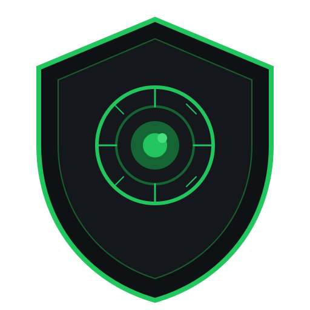

# SafeOS Guardian

<div align="center">
  

  <p><strong>Deep-learning monitoring for pets, babies, and elderly care — running entirely in your browser.</strong></p>

  <p>
    <a href="https://safeos.sh">safeos.sh</a> ·
    <a href="https://frame.dev">frame.dev</a> ·
    <a href="https://wilds.ai/discord">Discord</a>
  </p>

  [](https://opensource.org/licenses/MIT)
  [](https://www.typescriptlang.org/)
  [](https://codecov.io/gh/framersai/safeos)
  [](https://web.dev/articles/progressive-web-apps)
  [](https://frame.dev)
</div>

---

## ⚠️ Not a replacement for human supervision

SafeOS Guardian is a **supplemental experimental tool**. It does not replace caregivers, medical monitoring equipment, or veterinary monitoring. Technology fails. Maintain direct supervision of children, pets, and elderly family members at all times.

---

## What it is

SafeOS Guardian is a Progressive Web App that turns any device with a camera and microphone into a deep-learning monitoring station. It loads [TensorFlow.js](https://www.tensorflow.org/js) and [Transformers.js](https://huggingface.co/docs/transformers.js) into the browser, runs every model on-device, and raises severity-tiered alerts when something matches. No frames leave the device. No telemetry. No account required for the local-only flow.

Once the models have cached after first load, the entire detection pipeline runs offline.

## Use cases

| Scenario | What SafeOS Guardian does |
|---|---|
| **Pet monitoring** | Eating, bathroom, distress vocalizations, prolonged stillness, intrusion into off-limits rooms. |
| **Baby & toddler monitoring** | Crying, sustained motion, breathing pattern anomalies, fall-from-bed events, in-frame hazards. |
| **Elder care** | Falls, confusion, prolonged inactivity, distress vocalizations, wandering out of frame. |
| **Lost & Found** | Match a missing pet or person against 1–5 reference photos using a perceptual fingerprint (color histograms + edge signatures). Runs continuously against the live camera. |
| **Wildlife & outdoor** | Backyard trail-cam, livestock checks, predator detection. Runs on cheap hardware with no internet. |
| **Authority / emergency response** | Temporary deployment over an at-risk area or shelter; severity-routed alerts to email / SMS / Telegram via the optional server. |
| **Small-business security** | Perimeter watch, after-hours intrusion detection, customer-traffic counting. Triggers escalating audio + push notifications. |
| **Personal safety** | Lone-worker check-ins, accessibility aid (e.g. doorbell detection for d/Deaf households), live-in caregiving environments. |

SafeOS is a **supplemental** tool. It augments human attention; it does not replace it. Privacy laws around recording vary by jurisdiction — only deploy on premises and people you have authority to monitor.

## Architecture


The solid path runs entirely in the browser, offline, after first load. The dashed path engages only when you deploy the optional API server and opt into individual integrations.

## How the deep learning runs in your browser

1. **First load.** The Next.js app shell loads from any static host (GitHub Pages, Vercel, Netlify, Cloudflare Pages). The service worker registers and starts caching the shell, fonts, and JS chunks.
2. **Model fetch.** When you open the monitor view, TensorFlow.js downloads the COCO-SSD weights (~5 MB, quantized) from the [`tfjs-models` CDN](https://github.com/tensorflow/tfjs-models/tree/master/coco-ssd). The service worker intercepts the response and stores it in the Cache Storage API. Subsequent loads serve the weights from the cache — no network needed.
3. **Backend selection.** TF.js auto-selects the fastest available backend: [WebGPU](https://www.w3.org/TR/webgpu/) where the browser supports it, [WebGL](https://www.khronos.org/webgl/) otherwise, falling back to WASM SIMD on older devices. A modern laptop runs COCO-SSD at 20–30 FPS on WebGL; mobile devices typically land at 10–15 FPS.
4. **Per-frame screening.** A `setInterval` loop at 200 ms samples the `<video>` element into a hidden `<canvas>`, runs pixel-diff motion detection and an FFT pass over the Web Audio `AnalyserNode`, and tracks pixel-change counts. This layer is cheap enough to run continuously without spinning up a GPU context. Code: [`apps/guardian-ui/src/components/CameraFeed.tsx`](apps/guardian-ui/src/components/CameraFeed.tsx).
5. **Gated inference.** When motion, audio, or pixel-change crosses the per-scenario threshold, the gated frame is handed to TF.js. COCO-SSD's `model.detect()` returns bounding boxes, class labels, and confidence scores. The model itself is capable of 10–30 FPS on WebGL/WebGPU, but the pipeline only invokes it on triggered frames: typically a fraction of a Hz, except during sustained activity. The motion gate lives in [`apps/guardian-ui/src/lib/person-detection.ts`](apps/guardian-ui/src/lib/person-detection.ts).
6. **Tie-breaker pass.** When COCO-SSD's top prediction is below the per-scenario confidence threshold, the frame is routed to a quantized ViT-base (~89 MB, [Xenova/vit-base-patch16-224](https://huggingface.co/Xenova/vit-base-patch16-224)) running under Transformers.js. ViT is heavier but better at fine-grained scene labeling. It's used as a secondary check, not the primary path.
7. **Audio parallel path.** The Web Audio API exposes a [`AnalyserNode`](https://developer.mozilla.org/en-US/docs/Web/API/AnalyserNode) over the microphone. FFT bins are sampled every ~100 ms; thresholds detect cry/distress, glass break, sustained silence, and other audible events. No model needed.
8. **Lost & Found fingerprinting.** Reference photos are reduced to a 32-bin color histogram + top-5 dominant colors (k-means) + an 8×8 Sobel edge grid. The matcher samples the live feed at 1–2 FPS and compares each candidate frame by cosine similarity. Under 1 KB per reference photo. Code: [`apps/guardian-ui/src/lib/visual-fingerprint.ts`](apps/guardian-ui/src/lib/visual-fingerprint.ts).
9. **Alert engine.** Matches feed into a severity router (info / low / medium / high / critical). Each severity has its own escalation curve: volume-ramping local audio, browser push, and optional fan-out to email / SMS / Telegram via the API server.
10. **Storage stays local.** Settings, alert history, and visual fingerprints are persisted in [IndexedDB](https://developer.mozilla.org/en-US/docs/Web/API/IndexedDB_API) on your device. The rolling video buffer keeps only the last 5–10 minutes in memory; older frames are overwritten.

The optional API server (`src/`) only enters the picture when you opt into fan-out channels (Resend, Twilio, Telegram), multi-device WebSocket sync, or a bridge to a local [Ollama](https://ollama.com) install for richer scene reasoning.

## Models

Every model runs client-side. Sizes are quantized model weights served from a CDN and cached by the service worker on first load.

| Job | Model | Framework | Size | Source |
|---|---|---|---|---|
| Object detection (motion-gated; 10–30 FPS when firing) | COCO-SSD (MobileNetV2 backbone) | [TensorFlow.js Models](https://github.com/tensorflow/tfjs-models/tree/master/coco-ssd) | ~5 MB | tfjs-models |
| Scene classification fallback | `Xenova/vit-base-patch16-224` | [Transformers.js](https://github.com/huggingface/transformers.js) | ~89 MB | [Hugging Face](https://huggingface.co/Xenova/vit-base-patch16-224) |
| Audio analysis | FFT bins via [Web Audio API](https://developer.mozilla.org/en-US/docs/Web/API/Web_Audio_API) | native | 0 KB | MDN |
| Visual fingerprinting | Color histograms + Sobel edges | hand-rolled | < 1 KB / photo | [`apps/guardian-ui/src/lib/visual-fingerprint.ts`](apps/guardian-ui/src/lib/visual-fingerprint.ts) |

### Optional: local LLM for harder scenes

When detection is ambiguous, you can route the frame to a local [Ollama](https://ollama.com) install on the same network. Nothing leaves your LAN.

| Model | Size | Latency | Use |
|---|---|---|---|
| [`moondream`](https://ollama.com/library/moondream) | ~1.7 GB | ~500 ms | Fast triage |
| [`llava:7b`](https://ollama.com/library/llava) | ~4 GB | 2–5 s | Detailed analysis |
| [`llama3.2-vision:11b`](https://ollama.com/library/llama3.2-vision) | ~7 GB | 5–10 s | Complex reasoning |

### Optional: cloud fallback

When local resources are exhausted (e.g. on a low-end phone with no Ollama box on the LAN), you can configure cloud fallback through your own API keys. Each provider receives only the frames that local models couldn't classify with confidence.

- [`gemini-flash-1.5`](https://ai.google.dev/gemini-api/docs/models/gemini#gemini-1.5-flash) via [OpenRouter](https://openrouter.ai)
- [`gpt-4o-mini`](https://platform.openai.com/docs/models/gpt-4o-mini) via OpenAI
- [`claude-3-haiku`](https://docs.anthropic.com/en/docs/about-claude/models) via Anthropic

## Notification channels

SafeOS Guardian fans out alerts across four channels, routed by severity:

| Severity | Browser push | Email (Resend) | SMS (Twilio) | Telegram |
|---|:---:|:---:|:---:|:---:|
| info / low | ✓ | — | — | — |
| medium | ✓ | ✓ | — | ✓ |
| high | ✓ | ✓ | ✓ | ✓ |
| critical | ✓ | ✓ | ✓ | ✓ |

Browser push is the only channel that works without the API server. The other three require [Resend](https://resend.com), [Twilio](https://www.twilio.com), and a [Telegram bot](https://core.telegram.org/bots) respectively — all opt-in.

### Email alerts via Resend

[Resend](https://resend.com) sends severity-routed alert email when something matches. Free tier covers 3,000 emails/month.

Two ways to wire it up:

1. **Server-wide key (operator pays).** Set `RESEND_API_KEY`, `EMAIL_FROM`, and `EMAIL_REPLY_TO` in the API server's `.env`. Every user of that deployment can opt in to email alerts without bringing their own key. Transactional auth email (verification + reset) requires this path.
2. **Bring your own key (per user).** In the app, go to **Settings → Notifications**, toggle on email alerts, and enable **Use my own Resend account**. Paste a Resend API key + a verified sender. The key stays in your browser's local storage and is only sent to the API server when an alert dispatches.

Email only fires when the toggle is **on** AND a recipient address is set. See [`apps/guardian-ui/src/app/help/integrations/resend`](apps/guardian-ui/src/app/help/integrations/resend) for the full setup walkthrough or read [`src/lib/alerts/email.ts`](src/lib/alerts/email.ts) for the implementation.

## Detection modes

| Scenario | What it watches for |
|---|---|
| **Pets** | Eating, bathroom, distress vocalizations, prolonged stillness |
| **Baby / Toddler** | Crying, movement, breathing patterns, safety hazards in frame |
| **Elderly** | Falls, confusion, distress, prolonged inactivity |
| **Lost & Found** | Visual match against 1–5 reference photos via color + edge fingerprints |

Each scenario has its own thresholds in [`apps/guardian-ui/src/lib`](apps/guardian-ui/src/lib) and on-device profile configuration.

## Privacy guarantees

- **Rolling buffer.** Camera frames live in memory for 5–10 minutes, then overwrite.
- **No cloud uploads** in PWA-only mode. Period.
- **No telemetry.** No analytics SDK, no model-improvement uploads, no Sentry beacon.
- **IndexedDB only.** Settings, alert history, and reference photos stay in [browser-local storage](https://developer.mozilla.org/en-US/docs/Web/API/IndexedDB_API).
- **Optional integrations are opt-in.** Twilio, Telegram, Ollama, and cloud fallback fire only when you configure them.

## Quick start

### PWA only (recommended)

```bash
cd apps/guardian-ui
pnpm install
pnpm dev
```

Open <http://localhost:3000>. Models download on first use, then cache offline.

To deploy as a static site:

```bash
pnpm build      # writes ./out
# deploy out/ to GitHub Pages, Vercel, Netlify, Cloudflare Pages, any CDN
```

### Full stack (only if you need server-side fan-out)

```bash
pnpm install
pnpm dev        # API + UI together
# or:
pnpm run api    # port 3001
pnpm run ui     # port 3000
```

### Local LLM (optional)

```bash
brew install ollama         # macOS; see ollama.com for other platforms
ollama serve
ollama pull moondream
ollama pull llava:7b
```

Point `OLLAMA_HOST` at your Ollama instance in `.env`.

## Configuration

Copy [`.env.example`](.env.example) to `.env`. Every variable is optional unless you deploy the API server.

```env
# Local LLM
OLLAMA_HOST=http://localhost:11434

# Cloud fallback (only configure what you want to use)
OPENROUTER_API_KEY=sk-or-...
OPENAI_API_KEY=sk-...
ANTHROPIC_API_KEY=sk-ant-...

# Server-side notifications
TWILIO_ACCOUNT_SID=AC...
TWILIO_AUTH_TOKEN=...
TWILIO_FROM_NUMBER=+1...
TELEGRAM_BOT_TOKEN=...

# Email alerts via Resend (optional, recommended)
RESEND_API_KEY=re_...
EMAIL_FROM="SafeOS Guardian <alerts@yourdomain.com>"
EMAIL_REPLY_TO="team@yourdomain.com"

# Browser push (requires the API server to sign payloads)
VAPID_PUBLIC_KEY=...
VAPID_PRIVATE_KEY=...
```

Sensitivity thresholds live in [`src/lib/analysis/profiles/`](src/lib/analysis/profiles/). Each scenario has its own profile.

## Project layout

```
packages/safeos/
├── apps/guardian-ui/        # Next.js PWA — runs the models in your browser
│   └── src/
│       ├── app/             # Routes (dashboard, monitor, history, settings)
│       ├── components/      # CameraFeed, AlertPanel, LostFoundSetup, …
│       ├── lib/             # visual-fingerprint, motion-detection, websocket
│       └── stores/          # Zustand stores (monitoring, lost-found, onboarding)
│
├── src/                     # Optional Express API
│   ├── api/                 # HTTP + WebSocket routes
│   ├── lib/
│   │   ├── analysis/        # Frame analyzer + cloud fallback
│   │   ├── alerts/          # Escalation, Twilio, Telegram, browser push
│   │   ├── audio/           # Distress / cry detection
│   │   ├── ollama/          # Local LLM client
│   │   └── webrtc/          # Signaling
│   └── queues/              # Job queues (analysis, human review)
│
├── tests/                   # vitest — unit + integration
├── docker-compose.yml       # API server + Postgres
└── Dockerfile               # API server image
```

## Testing

```bash
pnpm test            # all tests
pnpm test:coverage   # with coverage
pnpm test:watch      # watch mode
```

## Deployment

The PWA is a static export. Deploy `apps/guardian-ui/out` to any CDN — GitHub Pages, Vercel, Netlify, Cloudflare Pages. No server is required.

The API server ships as a Docker image:

```bash
docker build -t safeos .
docker run -p 3001:3001 --env-file .env safeos
```

Or run it under PM2:

```bash
pnpm build
pm2 start dist/index.js --name safeos-api
```

## Contributing

See [CONTRIBUTING.md](../../CONTRIBUTING.md). The four ground rules:

1. **Privacy first.** Never persist more than the task requires.
2. **Fail safe.** Default to alerting when uncertain.
3. **Offline first.** Core features must work without internet.
4. **Accessibility.** WCAG AA contrast, keyboard navigation, screen-reader-friendly labels.

## License

MIT. Part of [Frame](https://frame.dev)'s 10% for Humanity initiative — this service stays free, forever.

## Acknowledgments

- [TensorFlow.js](https://www.tensorflow.org/js) and the [`tfjs-models`](https://github.com/tensorflow/tfjs-models) team for the COCO-SSD port.
- [Hugging Face](https://huggingface.co) and [Xenova](https://huggingface.co/Xenova) for Transformers.js and the quantized ViT weights.
- [Ollama](https://ollama.com) for making local vision models trivial to run.
- [Resend](https://resend.com) for transactional + alert email with a generous free tier.
- The Frame team and the people on Discord who keep stress-testing this thing.

---

<div align="center">
  <p><strong>Remember:</strong> this tool supplements, never replaces, human care.</p>
</div>
